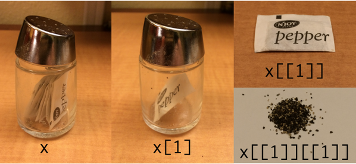

***

# Day 1

- [Getting setup]
- [Coding basics]
- [R as a second language]
- [R Community = Packages + help?]
- [Plotting]

#

## [Getting setup]
- Install the newest version of __RStudio__ from [here](https://www.rstudio.com/products/rstudio/#Desktop)
 - You do not need RStudio to run R. We do suggest it however for the
      improvements it offers over the default R GUI (a more seamless
      integration of scripts, console and graphs) along with some
      other additional features.
 - While RStudio offers some point-and-click GUI alternatives, we will
   not be using or teaching them in this class.

## Set up your project space

- Create a directory on your Desktop called Rwksp
- Create the following folders:
 - data (This is self explanatory)
 - src (This is where your code lives)
 - docs (This is where other files that aren't code or data should live)
- I also suggest creating a README file for you to put some general
  notes about the workshop

## Say hello to the Console...

The Console is a command line where you can enter text, as if you are "talking"
to the computer.

```{r}


```

## Activity: Try out some math

```{r}


```


```{r}
2+2
2-2
2*2
2/2
2%*%2
```

## Operators, Objects and Functions

Operators are characters that do things like math, logical operations,
equalities, etc.

Objects (aka. variables) are names that can "store" information, like
data.

Functions are special types of objects that can do things, they all
have the form of <tt>**name**</tt>(*arguments*). For example:

```{r, eval=FALSE}
help('help')
```

##Data types and Object classes

There are multiple data types, but for now we just want you to be
aware that are different types:  characters vs. numbers vs. logical

If you do not use "" (or ''), R will read whatever word/combination of
characters you type as an object. Therefore R will read ``` ABCD ```
as an attempt to call an object that doesn't exist, but ``` "ABCD" ``` as a character string.

## Activity: What can we do with objects?

##

```{r, results = T}
x <- 4
y <- 6
x + y
z <- "Hello Harvard Forest"
print(z)
```

##

We will go more in on object classes later in the workshop, but for
now there is one important class you need to know and that is vectors.
Vectors are objects that have multiple numbers (or strings, or
logicals, etc) contained within.  To create a vector do the following:
``` objectname <- c(1,2,3,4,5)``` . ```c()``` is a function that
stands for concatenate.


## Activity: What if we want to store more than one value at a time?

##

```{r, results = T}
v <- c(1,2,3,4,10)
sum(v)

v2 <- c(10,15,20,30,40)
v + v2

```

##
## [R as a second language]

- Learning R (or any computer language) is similar to learning a foreign language.
- You have to learn more than just the words: you have to learn the
  grammar, punctuation and syntax of the language.
- Just like in a foreign language, R has many commands that are
 cognates of English words.  This is helpful when learning, as you
 often can figure out what a function does from its name alone.
- Though be wary, just like in human languages there are
 sometimes false cognates.

## Can you guess what the following functions do?

```{r, eval = FALSE}
mean(x)
max(x)
plot(x)
Map(x)
```

## About arguments...

- Most functions have default settings for most arguments
- You don't always have to state the argument name, R infers from the
  ordering of the arguments
- Like Las Vegas, what happens in a function, stays inside a function
  (most of the time...), so you don't have to worry about argument
  names that are inside of functions over-writing your objects outside
  of the function
- Use <tt>tab</tt> to try and complete the names of functions and
  arguments

## Activity: Pick a function and explore the arguments!

##

1. <tt>help()</tt> or <tt>?</tt>
2. Use tab completion

## Scripting

A script is a file that you can store your code for later use!

So, open up a new script file and save it to your Rwksp/src directory.

Commenting can be done using <tt>#</tt> because R will ignore the
entire line to the right of it.


## Style and Annotation

Be sure to use style (i.e. formatting of your code) and annotation
that will make your code usable later by others and yourself!

> 1. R script names should always end in .R
> 2. Try and keep names simple, i.e. 3-5 characters, lowercase
> 3. Put spaces around operators and after commas and before left parentheses except after function names
> 4. Use <tt> <- </tt> for assignment, rather than <tt>=</tt>
> 5. For more info on appropriate formatting, see http://stat405.had.co.nz/r-style.html


***
# Day 2

## REUs, climate change and the ninja-pirate-zombie apocalypse

1. Get the data 
2. Check the data
3. Prep the data
4. Visualize patterns
5. A bit about statistics and some tests
6. Export results
7. Make and save final figures

 
##Warm-Up 

__Activity: Write a script that will do some useful math!__
                                                                               
### Object Management
After spending some time playing with R you may realize that you've created 
a lot of objects with assorted names, shapes, and sizes. Luckily there are some
very useful functions that will help you keep track and clean up your workspace.
                                                                               
```{r, eval = FALSE}
ls()
rm()
rm(list = ls())
```

## 

Go ahead and clear your workspace now for the activities ahead.

## 1.  [Loading/Entering Data]

## The first thing we need to do for most analyses is get our data into R so that we can do things with it.

One way to do this is to enter it by hand.  We can do this in a few ways:
* Create multiple objects with our data:
```{r, results= T}
temperature <- c(70,80,50,53,60,45) # in Fahrenheit
precipitation <- c(.01,1,0,2,.8,1.5) # in inches
```

* Maybe more useful is to create a dataframe:

```{r, results = T}
weather <- data.frame(date = c("3/18","3/19","4/10","4/11","4/18","5/10"),temperature = c(70,80,50,53,60,45), 
                      precipitation = c(.01,1,0,2,.8,1.5) )
weather
```
                                                                               
#### __From this point on we will be using the data we collected from you all.__

http://tinyurl.com/REUdata-csv

```{r, echo=FALSE,results=F}
setwd('../')

```

## 

Often data will already be entered into other formats or programs and
we'll need to read it in so we can work with it.

_Note: There are many functions for reading-in different types of files._

__Remember:__ We have to make sure to save it as an object!

```{r, eval = T , results = F}
REUdata <- read.csv("../../data/REUdata.csv")

```

## 2.  [Checking Data]


The first thing we need to do after we read in our data is to look at it.  This accomplishes a couple things:

1. We can get to know our data.
2. We can see if R has accidentally changed the data (often column
   names will be different if they were ented in Excel or other
   programs), and sometimes even the data may have been reformatted.
3. We can look for errors : often data will have quality issues. There
can be typos, misclassifications, and missing data.


## 

There are all kinds of tools available to us for data
exploration. Here are some common ones that we'll use today:

* ```summary(),hist(),table(), is.na(), complete.cases(), names(), head(),tail()```

## 

Note: We will cover selection/indexing/subsetting of data in much more
detail in the next class.  For now, the main thing to pay attention to
is that using the ```[]``` brackets after our object name and then the
column name comes in quotations and after a comma:
```ObjectName[,"ColumnName"]```


```{r, eval = T}
REUdata[,"Name"]  ####THIS IS HOW YOU SELECT A COLUMN
head(REUdata)
table(REUdata[,"I.have.used.R"])

```

## Activity: Play with the data...


## Wait. We're missing an important step.

1. Get the data 
2. Check the data
3. Prep the data
4. Visualize patterns
5. A bit about statistics and some tests
6. Export results
7. Make and save final figures


## Wait. We're missing an important step.

0. Get a question and decide on analyses
1. Get the data 
2. Check the data
3. Prep the data
4. Visualize patterns
5. A bit about statistics and some tests
6. Export results
7. Make and save final figures

## 0. [Questions?]

What are some questions that people are curious about?

<!-- Matt will cover this -->


## 3. [Prep the data]

Let's look at the responses to the Pirates or Ninjas question.
```{r, eval = T}
table(REUdata$Pirates.or.Ninjas)
```

As we can see there are many responses that don't fall under the category Pirate or Ninja. For our first pass,
we want to get rid of any that aren't just clearcut Pirates or Ninjas. 
To do that we need to make a clean version of it without the other values.

##

```{r , eval=T,results=T}
pirates.or.ninjas <- c('p','n','p',NA,'p','n','n','p',NA,NA,NA,'p','p',NA,'p',NA,'p','n',NA,'n','n',NA)

table(pirates.or.ninjas)

barplot(table(pirates.or.ninjas))

##We can then append this new clean "Pirates or Ninjas to our dataframe"
names(REUdata)

REUdata[,"clean.Pirates.Ninjas"] <- pirates.or.ninjas
names(REUdata)

```

##Activity: play around with plots!

Pick one of the questions we came up with and figure out a way to
visualize that data.  Some common plotting functions that you might
want to use are: ```plot(), barplot(), boxplot(), hist()```

## Statistics: Testing for generality

<!-- Matt: add PDQ stats intro and search with google -->

- Statistics are used to make sense of data
- Statistical tests are used to generalize the results obtained from a
  sample
- Frequentist statistics is one possible school of statistics that
  defines probabilities as long run frequencies and uses the
  probability of "null" hypotheses to answer statistical questions

## Export data

While in general it's preferable to output figures or summary files,
there are times when you'll want to save your cleaned and processed
data.  One way to do this is to output in the same format that read it
in with```write.csv()```.  

Another option is to use ```save()``` which can save your R object as
is. This has some uses if you have a format that's not amenable to
writing to a .csv or other common format.

## Export figures

One of the great things about R is that you can make highly
customizeable and presentation/publication ready figures with
ease. But once we make them we'll need to get them out of R.  One easy
way to do this is to right-click on the figure itself (in either R or
Rstudio) and paste it wherever you want.  Alternatively you can use
commands to output figures:  ```{r,eval = F} pdf() # or jpeg() or many
other common formats plot()#Code to create figure dev.off() #this will
close and save the image.  ```

## Topics for Day 3 and beyond!

- The art of modularizing code 
- subsetting data
- character searching
- string manipulation
- running a leaflet or shiny app
- loops and apply functions
- lists


<!-- # Day 3  -->

<!-- - [Stats and science]  -->
<!-- - [Results: organization and reporting] -->
<!-- - [Life-long lea**R**ning] -->

<!-- ### [R Community = Packages + help?] -->

<!-- - As we mentioned before one of the great things about R is the -->
<!--   community that comes with it. This is helpful in many ways, a few of -->
<!--   which we'll discuss a bit more in depth: -->

<!-- ## [Data manipulation] -->

<!-- * Vectors - indexing -->
<!-- * Matrices - rows and column -->
<!-- * Data Frames - mixing data types -->
<!-- * Lists - applys -->

<!--  -->


<!-- ## -->

<!-- Perhaps the most important resource out there to a new R user are -->
<!-- packages.  While base R comes with many handy functions you will -->
<!-- quickly reach a point where you want to do something that the basic -->
<!-- functions don't cover. -->

<!-- Packages to the rescue! Many people have already poured hours into -->
<!-- creating new functions that do many, many different things.  They -->
<!-- bundle to these functions into 'packages' that are then made freely -->
<!-- available. -->

<!-- ## -->

<!-- First we need to know the package name so we can install it: -->

<!-- ```{r, eval = FALSE} -->
<!-- install.packages("raster") -->
<!-- ``` -->

<!-- ## -->

<!-- You only have to install a package once on your computer. Once it is -->
<!-- installed we can then load it into any script in the future: -->

<!-- ```{r, eval = FALSE} -->
<!-- library("raster") -->
<!-- ``` -->


<!-- ## -->

<!-- Once loaded, we can now use any of the functions from that package: -->

<!-- ```{r, eval = FALSE, warning= FALSE} -->
<!-- library("raster") -->
<!-- r <- raster(matrix(1:25,5,5)) -->
<!-- plot(r) -->
<!-- ``` -->

<!-- ## -->

<!-- This can save you from having to reinvent the wheel each time you need -->
<!-- to do something new! -->

<!-- - Help literature: it can be daunting trying to remember what every -->
<!--   function does and what input is needed to run that function?  Your -->
<!--   new best friend is this simple command: `?function.name` .  Putting -->
<!--   a `?` in front of any function and running that line will bring up -->
<!--   the documentation for that function that should tell you everything -->
<!--   you need to know to use it. -->
<!-- - Stack Overflow and various other online resources: There is already -->
<!--   an abundance of information and tips about R -->
<!--   online. [Stack Overflow](http://stackoverflow.com/) especially often -->
<!--   has questions and answers that may help you figure out whats going -->
<!--   on with your code.  As R continues to grow in popularity, there are -->
<!--   more and more specialized sites devoted to various disciplines that -->
<!--   use R. -->
<!-- ## -->


<!-- ## [Stats and science]  -->

<!-- ## [Results: organization and reporting] -->

<!-- ## [Life-long lea**R**ning] -->


<!-- #  -->

<!-- - TBD: Optional Hacker Session 1 and 2 (e.g. GIS and mapping, iterative -->
<!--   functions, accessing the Harvard Forest Archives, linear algebra, -->
<!--   making Shiny or Leaflet apps) -->


<!-- # [Why R?]  -->

<!-- <div class="notes"> -->

<!-- - Introduce yourselves (role at HF, experience with programming and -->
<!-- analyses, fun fact) -->

<!-- </div> -->


<!-- ##  -->

<!-- R is obviously not the only option when it comes to programming -->
<!--      languages. Ditto for statistical tools. In fact, everything you -->
<!--      can do in R you can probably do in any number of other -->
<!--      programs/languages/webapps/etc.  -->

<!-- So why do we teach R? -->

<!-- ##  -->

<!-- R is immediately useful. Once you know even a little bit it can save -->
<!-- you time over programs like Excel and Google sheets.  With only 2 -->
<!-- lines of code we can create a dataset AND plot it.  With three we can -->
<!-- add custom text. -->

<!-- ##  -->

<!-- ```{r, eval=TRUE} -->

<!-- fake_data <- rnorm(45,mean = 240, sd = 12) -->
<!-- hist(fake_data, col = "lightblue") -->
<!-- text(x = 242, y = 4, "How long would this take in Excel?" , font = 2,cex = 1.2,  col = "red") -->

<!-- ``` -->

<!-- ##  -->

<!-- > - R is growing in popularity - not just for statistics, it is being -->
<!--   adopted for a variety of uses. -->
<!--  > - This means that learning even just the basics can help you in many -->
<!--       paths, not just if you end up teaching REUs at Harvard Forest ;) -->
<!--  > - Pragmatically: Knowing R is an extremely marketable skill in -->
<!--       research, finance, etc. -->
<!--  > - This also means there's a growing community out there to help you - -->
<!--       more on this in a bit. -->

<!-- ##  -->
<!-- > - R is open-source and free. -->
<!--  > - This aligns with our philosophy of open access, documented science. -->
<!--  > - Pragmatically: You and your collaborators will always have access -->
<!--  to it regardless of funds and institutional affiliation. -->

<!-- ## Leaflet -->

<!-- ```{r, echo = TRUE, eval = FALSE} -->
<!-- library("leaflet") -->
<!-- content <- paste(sep = "<br/>", -->
<!--                  "<b><a href='http://harvardforest.fas.harvard.edu'>Harvard Forest</a></b>", -->
<!--                   "REU R Introduction" -->
<!-- ) -->
<!-- m <- leaflet() %>% -->
<!--   addTiles() %>% -->
<!--   addPopups(lat = 42.5315, lng = -72.1899,  content)  -->
<!-- m  -->
<!-- ``` -->

<!-- ##  -->

<!-- ```{r, echo = FALSE} -->
<!-- library("leaflet") -->
<!-- content <- paste(sep = "<br/>", -->
<!--                  "<b><a href='http://harvardforest.fas.harvard.edu'>Harvard Forest</a></b>", -->
<!--                   "REU R Introduction" -->
<!-- ) -->
<!-- m <- leaflet() %>% -->
<!--   addTiles() %>% -->
<!--   addPopups(lat = 42.5315, lng = -72.1899,  content)  -->
<!-- m  -->
<!-- ``` -->

<!-- ## Shiny -->

<!-- - https://ecoapps.shinyapps.io/lvpredatorprey/ -->
<!-- - http://shiny.rstudio.com/gallery/ -->

<!-- ##  -->

<!-- <div class="notes"> -->

<!-- - Bring laptops, preferably with RStudio already installed -->
<!-- - Pen/paper for notes -->
<!-- - We'll make notes available that morning -->
<!-- - Thursday-Thursday-Friday -->
<!-- - Mentors are discouraged from attending, we'll keep them up to date -->
<!-- - Any questions? -->
<!-- - Questionnaire -->

<!-- </div> -->
